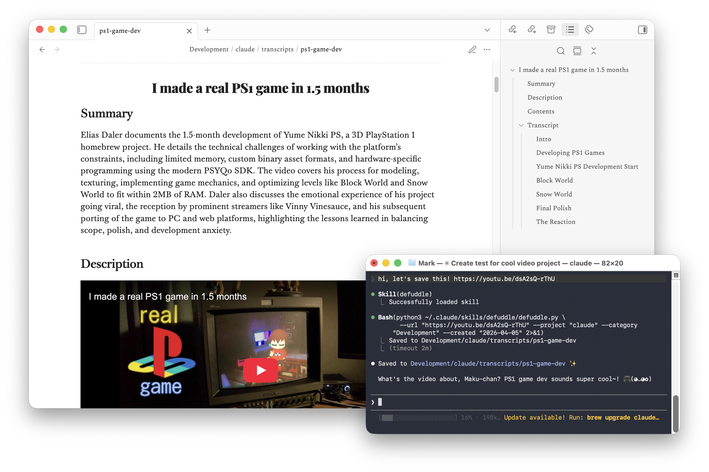

# Defuddle — Claude Code Skill

A [Claude Code](https://claude.ai/code) WebFetch replacement that extracts Markdown notes from web pages, YouTube videos, Apple podcasts, and academic papers, then saves them to your [Obsidian](https://obsidian.md) vault. Reduces token usage as Claude will only read the clean Markdown output (its native format!).

Just paste any URL into your conversation with Claude — that's it.



---

## What it does

**Articles & docs** — strips ads and clutter from any web page, generates an AI summary, extracts a heading index, and saves a clean Obsidian note with full frontmatter. Utilises archival services for JavaScript-rendered pages. Saved to `{project}/docs/`.

**YouTube videos** — fetches the full transcript with timestamps (linked back to the video), pulls chapter markers, generates a summary and description via AI, and saves a structured vault note. Saved to `{project}/transcripts/`.

**Apple podcasts** — fetches the episode transcript with timestamps, generates a summary and chapter markers, and saves a structured note. Saved to `{project}/transcripts/`. (Currently no other podcast platforms are supported.)

**Academic papers** — accepts DOI URLs (`https://doi.org/...`) and arXiv abstract URLs (`https://arxiv.org/abs/...`). Fetches the paper PDF (trying open-access sources, optionally a shadow library), converts it to markdown via the Datalab API or local `marker_single`, and saves a structured note with abstract, keywords as tags, and bibliography. Saved to `{project}/papers/`.

**Images** — when enabled, all images referenced in a saved note are downloaded and localised into an `/img` subfolder, with optional lossy compression via `pngquant` and `jpegoptim`.

All files are neatly stored in your Obsidian vault, so even with later use you can always refer back to it.

---

### Why this is token-efficient

Claude Code's built-in `WebFetch` tool fetches a page and dumps its content directly into Claude's context window — raw HTML, navigation, ads, footers and all. Claude then has to read through it to answer your question, burning tokens on noise.

This skill offloads the heavy lifting to dedicated tools instead:

- **Defuddle** runs outside Claude's context and strips the page down to just the article content before Claude ever sees it. Less noise, fewer tokens.
- **yt-dlp** fetches and parses YouTube transcripts entirely in a subprocess. Claude never processes raw VTT.
- **Datalab / marker_single** converts paper PDFs to markdown outside Claude's context. Claude never receives raw PDF content.
- **The Python script** handles all note formatting — frontmatter, tag extraction, keyword detection, timestamp linking, heading index, image downloading — without Claude having to reason about any of it.
- **The AI provider** Gemini, OpenAI, Ollama handles summarisation as a separate API call. Claude doesn't summarise the content itself, so a full article or transcript never needs to fit in its context window. Default model is Gemini free tier, so no costs. If disabled, a separate Claude model (e.g., efficient Haiku) is used as a fallback.

Claude's role is minimal: trigger the skill, receive the finished note, write it to disk. The result is a richer, more structured output than Claude could produce on its own — at a fraction of the token cost.

---

### Example article note

```
---
tags:
  - project/myproject
  - defuddle/doc
  - python
  - packaging
created: "2026-03-14"
title: "How to publish a Python package"
description: "A step-by-step guide to publishing a Python package to PyPI using modern tooling."
url: "https://example.com/python-packaging"
author: "Jane Smith"
published: "2024-11-01"
site: "example.com"
---

---

# How to publish a Python package

## Summary

A concise AI-generated summary of the article's key points...

## Index

- [[#Setting up your project]]
- [[#Writing pyproject.toml]]
- [[#Publishing to PyPI]]

---

[full article content]
```

## Requirements

| Tool | Purpose | Install |
|---|---|---|
| [Claude Code](https://claude.ai/code) | Runs the skill | See Claude docs |
| [defuddle](https://github.com/kepano/defuddle) | Extracts clean content from web pages | `npm install -g defuddle` |
| [yt-dlp](https://github.com/yt-dlp/yt-dlp) | Downloads YouTube transcripts | `brew install yt-dlp` |
| Python 3.8+ | Runs the formatting script | Pre-installed on macOS |
| [Obsidian](https://obsidian.md) | Your note vault (optional) | See Obsidian site |

**Optional — 3rd party AI enrichment** (summaries, tags, descriptions):

| Tool | Purpose | Install |
|---|---|---|
| Gemini API key | AI enrichment via Google (default) | [aistudio.google.com/apikey](https://aistudio.google.com/apikey) — free tier available |
| [Ollama](https://ollama.com) | Local AI enrichment (no key needed) | `brew install ollama` |

 > **Note:** AI enrichment always runs — if no provider key is configured, the skill automatically falls back to the Claude fallback model (Haiku by default). Configuring a dedicated provider (e.g. a free tier Gemini model) is optional but recommended to avoid using Claude tokens.

**Optional — PDF papers:**

| Tool | Purpose | Install |
|---|---|---|
| Datalab API key | Cloud PDF→markdown conversion | [datalab.to](https://datalab.to) — free accounts get $10 in credits (costs 10-15 cents per paper) |
| [marker-pdf](https://github.com/VikParuchuri/marker) | Local PDF→markdown fallback | `pip install marker-pdf` |

**Optional — image compression:**

| Tool | Purpose | Install |
|---|---|---|
| pngquant | Lossy PNG compression (~60–80% smaller) | `brew install pngquant` |
| jpegoptim | JPEG compression (quality ceiling 85) | `brew install jpegoptim` |

---

## Installation

### 1. Copy the skill files

Place this folder at:

```
~/.claude/skills/defuddle/
```

So you end up with:

```
~/.claude/skills/defuddle/
├── SKILL.md
├── defuddle.py
└── README.md
```

### 2. Set your vault path

Open `defuddle.py` and set the `VAULT_PATH` setting near the top of the file to your Obsidian vault path (or wherever you want notes saved):

```python
VAULT_PATH = '/your/path/to/obsidian/vault'
```

### 3. Set up your projects registry (optional)

By default, notes are saved under `{vault}/{project}/docs/` etc., where `{project}` is a folder name you tell Claude when saving.

### 4. Allow required tools in Claude Code settings

Add these lines to your `~/.claude/settings.json` under `permissions.allow`:

```json
"Bash(defuddle **)",
"Bash(yt-dlp *)",
"Bash(python3 ~/.claude/**)"
```

> **Note:** `defuddle **` uses a double wildcard because URLs contain `/` characters which a single `*` won't match. Or at least that's how it seems to work...

Your full `settings.json` might look like:

```json
{
  "permissions": {
    "allow": [
      "Bash(defuddle **)",
      "Bash(yt-dlp *)",
      "Bash(python3 ~/.claude/**)",
      "Skill(*)"
    ]
  }
}
```

---

## AI enrichment (optional)

The skill supports multiple AI providers for generating summaries, descriptions, tags, and chapter markers. Configure your preferred provider in `defuddle.py` under `AI_LLM`:

### Gemini (default)

1. Go to [Google AI Studio](https://aistudio.google.com/apikey) and create a free API key
2. Open `~/.claude/CLAUDE.md` (create it if it doesn't exist) and add:

```markdown
## API Keys

- **Gemini**: `YOUR_GEMINI_API_KEY_HERE`
```

Uses the Gemini API. By default, `defuddle.py` uses `gemini-3.1-flash-lite-preview`, which is compatible with the free tier, but you can set the `AI_MODEL` to anything you like. See the [API pricing overview](https://ai.google.dev/gemini-api/docs/pricing) for which models are compatible with the free tier.

> **Note:** When not on the free tier, just remove the billing info and it will downgrade. The free tier is perfect for our use case!

### OpenAI or compatible APIs

Set `AI_LLM = 'openai'` in `defuddle.py` and add your key to `~/.claude/CLAUDE.md`:

```markdown
- **OpenAI**: `YOUR_API_KEY_HERE`
```

Set `AI_BASE_URL` to use any OpenAI-compatible endpoint instead of standard OpenAI:

```python
AI_BASE_URL = 'https://api.groq.com/openai/v1'   # Groq
AI_BASE_URL = 'https://zen.opencode.ai/v1'        # OpenCode Zen (free)
AI_BASE_URL = 'https://api.together.xyz/v1'       # Together AI
```

### Ollama (local, no key needed)

Set `AI_LLM = 'ollama'` and `AI_MODEL` to any model you have pulled:

```python
AI_LLM   = 'ollama'
AI_MODEL = 'llama3.2'
```

### Claude CLI fallback

If no API key is found or the configured provider fails, the skill automatically falls back to the Claude CLI. However, it will still run separately not taking tokens from your current session. Additionally, you can configure the fallback model with `AI_FALLBACK_MODEL` in `defuddle.py`. By default, it's set to use Haiku, which is much more token efficient than Sonnet/Opus.

---

## Academic papers

When given a DOI URL (e.g. `https://doi.org/10.48550/arXiv.1706.03762`), the skill:

1. Tries to fetch the arXiv LaTeX source directly (best quality rendering)
2. Falls back to the Datalab API for cloud PDF→markdown conversion
3. Falls back to local `marker_single` if Datalab is unavailable
4. Optionally tries a shadow library when access is restricted.

To enable Datalab, add your key to `~/.claude/CLAUDE.md`:

```markdown
- **Datalab**: `YOUR_DATALAB_API_KEY_HERE`
```

To configure a shadow library, set `SHADOW_BASE_URL` in `defuddle.py`:

```python
SHADOW_BASE_URL = 'https://your-shadow-library.example'
```

Set it to `''` to disable.

> **Note:** The shadown library has to support this url format for papers or they cannot be fetched: https://example.domain/10.1103/PhysRevB.57.6107

---

## Usage

Just share a URL in your Claude Code conversation:

> "Can you read this article for me? https://example.com/some-article"

> "https://www.youtube.com/watch?v=dsA2sQ-rThU"

> "Summarise this page: https://github.com/spaceage64/claude-defuddle"

> "https://doi.org/10.1145/3706598.3713709"

> "Check out this podcast: https://podcasts.apple.com/us/podcast/restitutio/id1053137114?i=1000741998143"

Claude will automatically use the defuddle skill. After fetching, it will ask if you'd like to save the note to your vault.

---

## How the skill is triggered

The skill's `description` field in `SKILL.md` tells Claude when to use it:

```
TRIGGER when: user provides any URL to a webpage, documentation, article, blog post,
or any standard web content.
DO NOT use WebFetch for these — use defuddle.
```

You can reinforce this in your own `~/.claude/CLAUDE.md` by adding:

```markdown
## Tools

- **Never use WebFetch for standard web pages** — always use the `defuddle` skill instead.
```

---

## Notes

- **Platform** — designed and tested on **macOS**. Linux should work for articles, YouTube, and papers — all dependencies are available, but it's untested. Windows may work with Claude Code for Windows and the relevant tools installed, also untested. Apple Podcasts is macOS-only regardless (TTML transcripts are stored by the macOS Podcasts app).
- **Transcripts** — the skill tries manual captions first (better quality), then falls back to auto-generated. Rolling-window caption artefacts (duplicated lines) are detected and removed automatically.
- **YouTube chapters** — if the video has chapter markers, they're inserted as `###` headings into the transcript at the correct timestamps. If not, the AI generates logical chapter breaks.
- **Tags** — hashtags in YouTube descriptions and keywords in paper abstracts are extracted and added to frontmatter. The AI also contributes additional content-based tags.
- **Images** — when `ENABLE_IMAGES = True`, images are downloaded into an `img/` subfolder next to the note. Invalid responses are detected leaving the original URL in the note instead.
- **Obsidian compatibility** — formatting has been adjusted to work well with Obsidian. There may be slight variations when viewing in other Markdown readers.